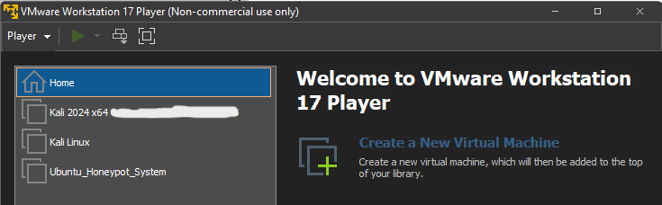
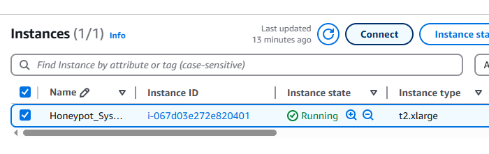
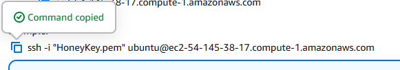
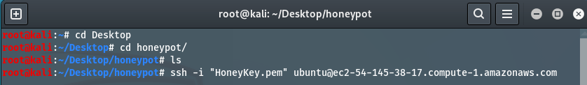

# Honeypot Setup and Monitoring using AWS & T-Pot
## Overview
This project involves deploying a T-Pot honeypot system on an AWS EC2 instance to proactively detect and analyze cyber threats. T-Pot combines various honeypot tools like Cowrie, Dionaea, and Honeytrap with visualization platforms such as Kibana and CyberChef, creating a comprehensive environment for monitoring malicious activity. By simulating vulnerable services, the system attracts attackers and logs their actions in real time. Data is processed through Logstash and stored in Elasticsearch, allowing for detailed analysis of attack patterns and behaviors. This setup offers valuable insights into cyber threats, supporting improved network defense and cybersecurity research.

## Project Objectives
- Set up an AWS EC2 instance and use the T-Pot application to deploy honeypots in it.
- Capture the data and other details of the attacker and their attacks.
- Visualize and analyze the attacker's behavior
- Perform a simple Cowrie Attack.

## What is Honeypot
A honeypot is a cybersecurity mechanism designed to attract and deceive potential attackers by simulating vulnerable systems or services within a network. It acts as a decoy, luring malicious actors into interacting with it while monitoring, recording, and analyzing their activities in a controlled environment. Honeypots do not serve any legitimate function for users, so any interaction with them is typically unauthorized and malicious, making them valuable tools for threat detection, research, and improving overall security posture.

## System Requirements
- Virtual Machine
  - VM software: VMware / any other preferred ones
  - OS: Kali Linux
  - vCPU: 2
  - RAM: 2GB
  - Storage: 20GB
- AWS EC2
  - AMI: Ubuntu Server 24.04 LTS (64-bit)
  - Instance Type: t2.xlarge / higher  (t2.xlarge: 4CPUs and 16GB RAM)
  - Storage: 128GB or higher
- T-Pot 
  - OS: Linux based
  - RAM: 8GB – 16GB
  - Storage: 128GB - 256GB

## Setup Steps
### Step 1: Virtual Machine (VM) Setup
- A Kali Linux virtual machine was set up on a local system using VirtualBox or VMware.
- Kali Linux, being a penetration testing and security-focused OS, provided the necessary tools to interact securely with the cloud instance.
- This VM served as the control center from which the AWS EC2 instance was accessed and configured via SSH.


### Step 2: Launching AWS EC2 Instance 
- Create an 'Ubuntu Server 24.04 LTS' EC2  instance on AWS and launch it.
- Save the keypair for logging into the instance in your VM.
- Also, copy the SSH command of the instance from the control option from the instance dashboard.



Step 3: SSH Access from Kali Linux 
- Open Kali Linux and then its terminal then navigate to the location where the instance's keypair is stored.
- Then execute this command, 
```bash
chmod 400 HoneyKey.pem
```
- This changes the permissions for the keypair file.
Then paste the SSH command in the terminal and run it. Now we have accessed our AWS EC2 instance.



[readme in progresss]
