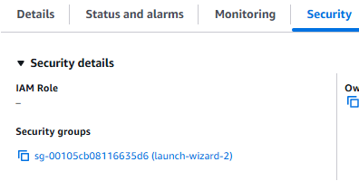
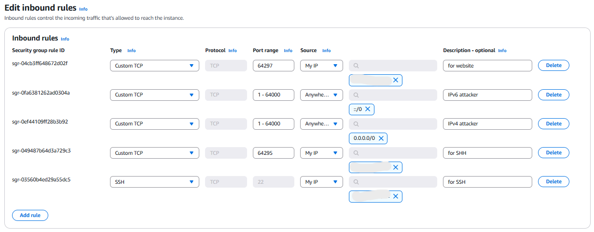
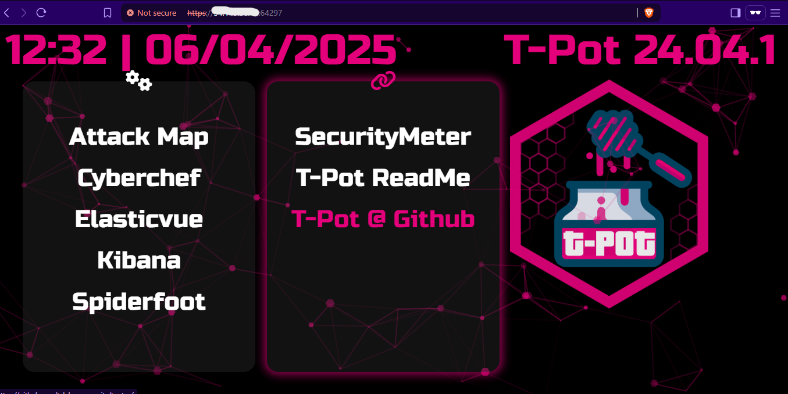

# Honeypot Setup and Monitoring using AWS & T-Pot
## Overview
This project involves deploying a T-Pot honeypot system on an AWS EC2 instance to proactively detect and analyze cyber threats. T-Pot combines various honeypot tools like Cowrie, Dionaea, and Honeytrap with visualization platforms such as Kibana and CyberChef, creating a comprehensive environment for monitoring malicious activity. By simulating vulnerable services, the system attracts attackers and logs their actions in real time. Data is processed through Logstash and stored in Elasticsearch, allowing for detailed analysis of attack patterns and behaviors. This setup offers valuable insights into cyber threats, supporting improved network defense and cybersecurity research.

## Project Objectives
- Set up an AWS EC2 instance and use the T-Pot application to deploy honeypots in it.
- Capture the data and other details of the attacker and their attacks.
- Visualize and analyze the attacker's behavior
- Perform a simple Cowrie Attack.

## What is Honeypot
A honeypot is a cybersecurity mechanism designed to attract and deceive potential attackers by simulating vulnerable systems or services within a network. It acts as a decoy, luring malicious actors into interacting with it while monitoring, recording, and analyzing their activities in a controlled environment. Honeypots do not serve any legitimate function for users, so any interaction with them is typically unauthorized and malicious, making them valuable tools for threat detection, research, and improving overall security posture.

## System Requirements
- Virtual Machine
  - VM software: VMware / any other preferred ones
  - OS: Kali Linux
  - vCPU: 2
  - RAM: 2GB
  - Storage: 20GB
- AWS EC2
  - AMI: Ubuntu Server 24.04 LTS (64-bit)
  - Instance Type: t2.xlarge / higher  (t2.xlarge: 4CPUs and 16GB RAM)
  - Storage: 128GB or higher
- T-Pot 
  - OS: Linux based
  - RAM: 8GB – 16GB
  - Storage: 128GB - 256GB

## Setup Steps
### Step 1: Virtual Machine (VM) Setup
- A Kali Linux virtual machine was set up on a local system using VirtualBox or VMware.
- Kali Linux, being a penetration testing and security-focused OS, provided the necessary tools to interact securely with the cloud instance.
- This VM served as the control center from which the AWS EC2 instance was accessed and configured via SSH.


### Step 2: Launching AWS EC2 Instance 
- Create an 'Ubuntu Server 24.04 LTS' EC2  instance on AWS and launch it.
- Save the keypair for logging into the instance in your VM.
- Also, copy the SSH command of the instance from the control option from the instance dashboard.


Step 3: SSH Access from Kali Linux 
- Open Kali Linux and then its terminal then navigate to the location where the instance's keypair is stored.
- Then execute this command, 
```sh
chmod 400 HoneyKey.pem
```
- This changes the permissions for the keypair file.
Then paste the SSH command in the terminal and run it. Now we have accessed our AWS EC2 instance.


### Step 4: Installing the T-Pot Honeypot Framework 
- Before installing T-Pot we have to simply update some things and install git in our EC2 instance.
Execute the following commands one by one:
```sh
sudo apt update
sudo apt upgrade
sudo apt install git
```
- Now Lets clone the git repository of the T-Pot from GitHub.
- Execute the following commands one by one:
```sh
sudo git clone https://github.com/telekom-security/tpotce.git

cd tpotce

./install.sh –type=user
```
- It will take some time. Then it will be asking create a username and password, so create one remember it and after that, we will have an option to choose a T-Pot edition and choose the Standard edition which contains all the basic and required tools that we need start to start the project.
- Now we have to reboot the instance. So to reboot we use the command, 
```sh
sudo reboot
```
- We will be logged out from the instance and we will be back to our Kali terminal.

### Step 5: Re-configure the port of the instance from AWS
- When T-Pot is installed it changes some of the ports associated with SSH and website. So we will make the following changes.
- In the AWS instance dashboard go to the security tab and from there click on the security group of our instance.

- In the security instance, we need to edit the inbound rules. For that click the 'Edit Inbound Rules' button and make the following changes:
#### Before changing the rules

#### After changing the rules

- After changing the rules press the 'save changes' button.

### Step 6: Accessing the T-Pot Dashboard 
- Now go back to our Kali VM's terminal and SSh into our instance again with the same SSH command but this time also mention the port number, so the command will be like, 
```sh
ssh -i "HoneyKey.pem" ubuntu@ec2-54-145-38-17.compute-1.amazonaws.com -p 64295
```
- Now open a private browser (preferred, just in case) or a normal one, and in the search box type 
```sh
https://<IP_address_of_EC2_instance>:64297
``` 
- IP of the EC2 instance will be shown in the details section of the instance dashboard in AWS.
- After browsing the URL it will show a security threat and all ignore it and proceed, then you wil be asked for the username and password which we created when we were setting up the T-Pot. So enter the credentials and we are now in the T-Pot dashboard.


### Step 7: Monitoring the Honeypots
- Many honeypots like Honeytrap, Cowrie, Dionaea, Tanner etc... are setuped automatically by the T-Pot.
- In the T-Pot main menu, there is an option Kibana, which visualizes and analyzes the attacks that are happening. It also has a beautiful dashboard so we will see the dashboard now by clicking the option.

- Attack Map shows the live attacks that are happening.

- Cyber Chef is a perfect payload inspection tool offered by T-Pot. 

- Elasticvue and Spiderfoot are other tools offered in T-Pot.

### - Step 8: Perform an Attack
- Now open Kali Linux in your VM and then open 'Hydra', it is a brute forcing tool.
- Also, make sure to download [rockyou.txt](https://github.com/brannondorsey/naive-hashcat/releases/download/data/rockyou.txt), which is a text file containing 1000s of usernames and passwords.
- In Hydra, I gave the inputs as follows:

[readme in progresss]
